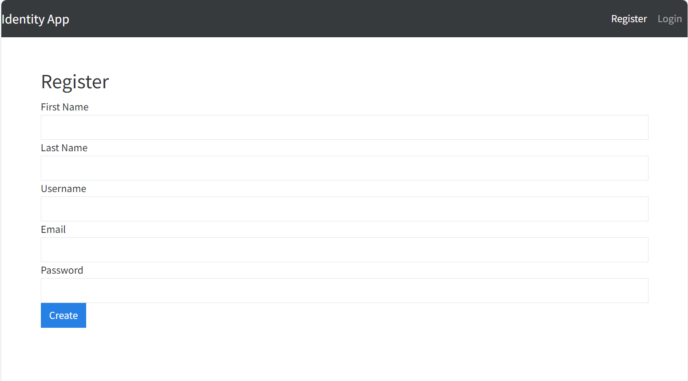
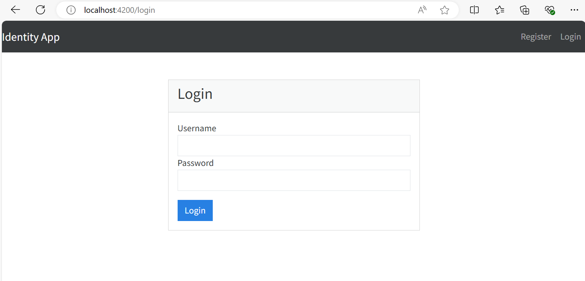
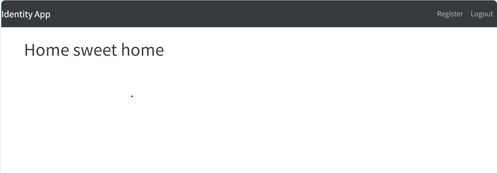

# GitHub Copilot exercise for User authentication using JWT application

The goal of the exercise is to create web application allowing to register a user and then to login using that user credentials.

The application consists of two different parts:
* .NET Core backend API
* Angular frontend web application

Backend API provides this functionality:
* ASP.NET Core Identity should be used for identity management
* API should provide at least two methods: user registration and authentication
* Optionally, token refresh method could be added, which should be accessible to authenticated users only
* For user registration first name, last name, email, user name and password fields must be provided
* In-memory database should used for storing registered user data (could be replaced with other database providers)
* The validation for provided data must be implemented (email length, password cmplexity, etc.)
* As a result of user authentication, the JWT token should be returned

Frontend web application must contain navigation bar with application name on the left side and *Register* and *Login* links on the right side. After user clicks *Register* link, the user registration page should be opened:

After clicking the *Create* button, the request to backend user registration method should be made. In case of any error, the error message should be shown on the bottom, of the screen. In case of success, success message should be shown for 5 seconds and all the fields should be cleared.

After user clicks *Login* link in the navigation bar, the login page should be opened:

After clicking the *Login* button, the request to backend user authentication method should be made. In case of any error, the error message should be shown on the bottom, of the screen. In case of success, the home page should be opened. The home page could contain any content, like:

The home page should be accessible to authenticated users only.
